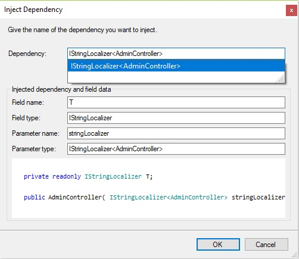
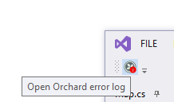

Visual Studio extension with many features and templates frequently used by [Lombiq](https://lombiq.com/) developers. Contains [Orchard CMS](https://www.orchardcore.net/)-related (including Orchard Core and Orchard 1.x) as well as generic goodies. For Orchard developers and for other .NET developers alike!

Are you looking for a VS 2019 or VS 2017 version of this extension? While due to limitations of the Visual Studio Marketplace we can’t publish it here, you can download it from [our GitHub](https://github.com/Lombiq/Lombiq-Orchard-Visual-Studio-Extension/releases/tag/v1.5.4) (just download and open the attached VSIX file).

# Highlights

Inject a constructor-inject dependency with ease, including all the tricky ones like `ILogger<T>`!

See a button on the toolbar light up, or even blink an LED if there are new entries in the error log!

# Features

- Dependency Injector: When a class is opened in the editor you can inject a dependency with this feature. Type the dependency name, hit Enter and it will be injected.
- Orchard Error Log Watcher: Watches the Orchard error log (or any other error log) and lights up an icon when a new entry was logged. And wait, there's more! This feature also supports [BlinkStick](https://www.blinkstick.com/) USB LED sticks that can blink or light up when an error happens. Check out [this video](https://www.youtube.com/watch?v=MQx5WpJqGi8) for a demo of the whole feature.

For more details check out the [Readme](https://github.com/Lombiq/Lombiq-Orchard-Visual-Studio-Extension/blob/master/Lombiq.Vsix.Orchard/Readme.md).

# Source, release notes, issues?

Fork me on [GitHub](https://github.com/Lombiq/Lombiq-Orchard-Visual-Studio-Extension)! There you can find the extension's Readme with release notes too. Also if you encountered bugs or have a feature request please add it on the GitHub page as well.

# Privacy policy

See it [here](https://lombiq.com/privacy-policy).

# Similar extensions

*   [Orchardizer](https://marketplace.visualstudio.com/items?itemName=CloudierTurtle.Orchardizer) also for Orchard developers
*   [VS Constructor Field Refactoring rule](https://github.com/sebastienros/vsconstructorfield) just for simply constructor-injecting dependencies
*   Furthermore the [Orchard Dojo Library](https://orcharddojo.net/orchard-resources/Library/Utilities/VisualStudioSnippets/) also has some VS code snippets that you can use without installing an extension